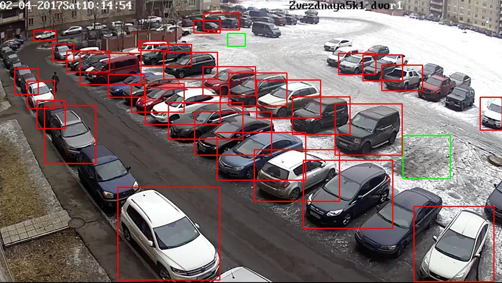

# Parkzone
<center></center>

____

## **Free space detection example**
<center></center>

## **Telegram bot**
____
This is telegram bot for finding free space for parking. It uses 2 servers: telegrambot server and camera server.  
  
Command in telegram: ```/getinfo```
1) Where is camera
2) Update and photo
3) Add camera
4) Count free spaces
